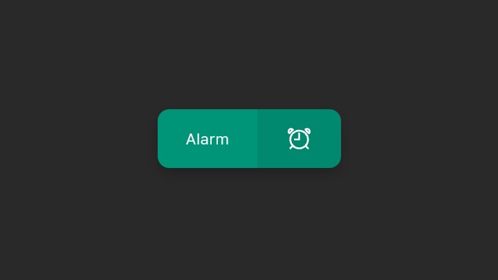

# Button With Icon

html & css codes for button with icon.

- the icon used in this button is from [ionicons.](https://ionic.io/ionicons)

- to use ionicons for your project, read this [usage](https://ionic.io/ionicons/usage) for installation.
